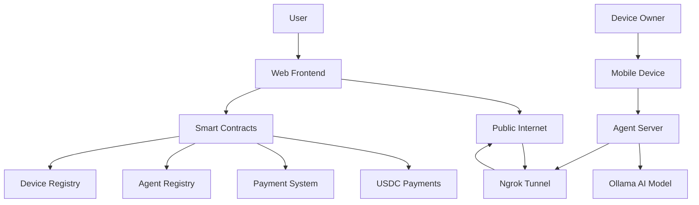

# Megha Network: Decentralized AI Agent Hosting Platform

*The world's first DePIN (Decentralized Physical Infrastructure Network) for AI agent hosting using consumer devices*

## 🔗 Quick Links to Core Components

| Component | Description | Link |
|-----------|-------------|------|
| **🏛️ Registry Contract** | Smart contract managing devices & agents<br/>**Address**: `0xe6692b5e9a229E66569f3d94092ad301D1fE6B43`<br/>**Network**: Arbitrum Sepolia | [📄 Registry.sol](./contract/Registry.sol)<br/>[🔍 View on Arbiscan](https://sepolia.arbiscan.io/address/0xe6692b5e9a229E66569f3d94092ad301D1fE6B43) |
| **🤖 Mobile AI Server** | Core server running agents & Ollama local LLM inference<br/>**Features**: WebSocket chat, AI processing, API endpoints | [📱 main.js](./agent-server/main.js) |
| **📋 Device Registration** | Automated script to register mobile devices in network<br/>**Features**: QR generation, wallet creation, self-management | [🔧 register-device.sh](./agent-server/register-device.sh) |

---

## 📋 Table of Contents

1. [The Problem We're Solving](https://github.com/SamFelix03/megha-network-arbitrum/edit/main/README.md#the-problem-were-solving)
2. [Business Model & Value Proposition](#-business-model--value-proposition)
3. [Why Arbitrum?](#-why-arbitrum)
4. [The Role of Blockchain](#-the-role-of-blockchain)
5. [Technical Implementation](#-technical-implementation)
6. [How to Use Megha Network](#-how-to-use-megha-network)
7. [Getting Started](#-getting-started)
8. [Architecture Overview](#-architecture-overview)
9. [Smart Contracts](#-smart-contracts)
10. [Roadmap](#-roadmap)
11. [Future Scope: Device Swarm Technology](https://github.com/SamFelix03/megha-network-arbitrum/edit/main/README.md#future-scope-device-swarm-technology)

---

## The Problem We're Solving

### **Centralized AI Infrastructure Crisis**
- **Expensive AI Services**: Traditional AI platforms charge $20-100+ per million tokens
- **Monopolized Compute**: Big tech companies control AI infrastructure, creating bottlenecks
- **Limited Access**: High costs exclude developers, small businesses, and individuals from AI innovation
- **Environmental Waste**: Billions of idle consumer devices (smartphones, laptops) sit unused while consuming manufacturing resources

### **Current AI Agent Limitations**
- AI agents are trapped in centralized platforms with limited customization
- Users can't monetize their AI creations or computing resources
- No true ownership or control over AI agents
- Lack of economic incentives for distributed AI hosting

---

## 💰 Business Model & Value Proposition

### **The DePIN Revolution for AI**
Megha Network transforms unused consumer devices into a **profitable AI infrastructure network**, creating a win-win ecosystem for all participants.

### **Value Creation for All Stakeholders**

#### 🖥️ **Device Owners (Supply Side)**
- **Passive Income**: Earn USDC by contributing idle devices (old phones, laptops, tablets)
- **Environmental Impact**: Extend device lifespan, reducing e-waste by 2-5 years per device
- **Zero Investment**: Use existing hardware without additional purchases
- **Automated Management**: Devices self-manage and auto-update network connectivity
- **Flexible Participation**: Contribute during idle hours, maintain full device control

#### 🤖 **AI Agent Creators & Users (Demand Side)**
- **Massive Cost Savings**: Access AI compute at **90%+ lower cost** than traditional platforms
- **True Ownership**: Create, customize, and monetize AI agents on-chain
- **Global Distribution**: Access distributed compute network for improved latency
- **Decentralized Hosting**: No single point of failure or platform risk
- **Blockchain Integration**: Native crypto/DeFi capabilities built into AI agents

#### 🌍 **Ecosystem Benefits**
- **Reduced E-Waste**: Prevents premature device disposal, supporting circular economy
- **Democratized AI**: Makes AI accessible to developers worldwide regardless of budget
- **Innovation Acceleration**: Lowers barriers for AI experimentation and deployment
- **Economic Inclusion**: Creates income opportunities for device owners globally

### **Economic Model**
```
Device Owner Earnings = Hosting Fee × Messages Processed
User Savings = Traditional AI Cost - Megha Network Cost (90%+ savings)
Network Effect = More devices → Better performance → More users → Higher earnings
```

---

## ⚡ Why Arbitrum?

### **The Perfect L2 for DePIN**
We chose **Arbitrum Sepolia** as our blockchain foundation for several critical advantages:

#### 🚀 **Technical Advantages**
- **Ultra-Low Gas Fees**: ~$0.001 per transaction enables micro-payments for AI compute
- **High Throughput**: 40,000+ TPS capacity handles high-frequency AI agent interactions
- **Ethereum Compatibility**: Full EVM support with existing tooling and infrastructure
- **Instant Finality**: Near-instant transaction confirmation for real-time AI responses

#### 💎 **Economic Benefits**
- **USDC Native**: Seamless USDC payments without bridging complexities
- **Cost Efficiency**: 100x cheaper than Ethereum mainnet for hosting fee payments
- **Scalable Economics**: Low fees enable profitable micro-transactions for AI services

#### 🔒 **Security & Decentralization**
- **Ethereum Security**: Inherits Ethereum's battle-tested security model
- **Fraud Proofs**: Optimistic rollup design with 7-day challenge period
- **Decentralized Validation**: Multiple validators ensure network integrity

#### 🌐 **Ecosystem Integration**
- **DeFi Native**: Easy integration with Arbitrum's thriving DeFi ecosystem
- **Developer Friendly**: Rich tooling, documentation, and community support
- **Bridge Infrastructure**: Seamless asset movement from other chains

---

## 🔗 The Role of Blockchain

### **Core Blockchain Functions**

#### 📝 **Smart Contract Registry**
- **Device Registration**: Immutable record of all participating devices and their capabilities
- **Agent Storage**: On-chain AI agent profiles, personalities, and tool configurations
- **Ownership Management**: Cryptographic proof of agent and device ownership

#### 💳 **Payment Infrastructure**
- **USDC Payments**: Native stablecoin payments for predictable pricing
- **Automated Settlements**: Smart contracts handle payment distribution
- **Transparent Economics**: All transactions publicly verifiable on-chain

#### 🤝 **Trustless Coordination**
- **No Central Authority**: Network operates without centralized control
- **Automated Matching**: Smart contracts match users with available devices
- **Dispute Resolution**: On-chain mechanisms for handling conflicts

#### 🔐 **Security & Verification**
- **Device Authentication**: Cryptographic verification of device participation
- **Payment Guarantees**: Smart contracts ensure payment for completed work
- **Immutable Records**: Permanent audit trail of all network activity

### **Decentralization Benefits**
- **Censorship Resistance**: No single entity can shut down the network
- **Global Access**: Available worldwide without geographic restrictions
- **Transparent Governance**: Community-driven development and upgrades
- **Economic Sovereignty**: Users control their AI agents and earnings

---

## 🔧 Technical Implementation

### **How It Works**


### **System Architecture Overview**



### **Component Deep Dive**

#### 🌐 **Frontend Application** (`/frontend`)
**Technology Stack**: Next.js 15, TypeScript, Viem, Tailwind CSS

**Core Features**:
- **Agent Creation Interface**: Visual builder for AI agent personalities and capabilities
- **Device Marketplace**: Browse and select available hosting devices
- **Wallet Integration**: MetaMask/Web3 wallet connectivity
- **Real-time Chat**: WebSocket connections to distributed AI agents
- **USDC Balance Management**: Native stablecoin integration for payments

**Key Files**:
- `src/app/create-agent/page.tsx`: Agent builder interface
- `src/app/marketplace/page.tsx`: Device selection marketplace
- `src/components/ui/Header.tsx`: USDC balance display and wallet connection
- `src/lib/constants.ts`: Contract addresses and ABIs

#### 🤖 **Agent Server** (`/agent-server`)
**Technology Stack**: Node.js, Express, WebSocket, Ollama, Ngrok

**Core Functions**:
- **AI Model Hosting**: Runs Ollama with Nemotron-Mini locally
- **API Endpoint**: RESTful API for agent interactions
- **Real-time Communication**: WebSocket support for live chat
- **Network Tunneling**: Ngrok integration for public accessibility
- **Self-Management**: Automatic ngrok URL updates to smart contract

**Key Files**:
- `main.js`: Core server application and WebSocket handling
- `register-device.sh`: Automated device registration and management
- `package.json`: Dependencies including Ollama integration

#### 📜 **Smart Contracts** (`/contract`)
**Technology Stack**: Solidity ^0.8.30, Hardhat

**Contract Address**: `0xe6692b5e9a229E66569f3d94092ad301D1fE6B43` (Arbitrum Sepolia)

**Core Functions**:

```solidity
struct Device {
    string deviceModel;      // Device hardware specs
    string ram;             // Memory capacity
    string cpu;             // Processor information
    string storageCapacity; // Storage space
    string os;              // Operating system
    address walletAddress;  // Device owner's wallet
    address ownerAddress;   // Device owner (can be different)
    string timestamp;       // Registration time
    string ngrokLink;       // Public tunnel URL
    string hostingFee;      // USDC per message cost
}

struct Agent {
    string uuid;            // Unique agent identifier
    string name;            // Agent name (e.g., "Tony Stark")
    string description;     // Agent capabilities
    string personality;     // Behavioral traits
    string scenario;        // Usage context
    string messageExample;  // Sample interaction
    string[] tools;         // Available blockchain tools
    string imageUrl;        // Agent avatar
    address ownerAddress;   // Agent creator's wallet
}
```

**Key Functions**:
- `registerDevice()`: Add new device to network
- `createAgent()`: Deploy new AI agent
- `updateDeviceNgrokLink()`: **Self-management function** - devices update their own URLs
- `getAllDevices()`: Browse available hosting devices
- `getAllAgents()`: Discover AI agents

### **Device Registration & Self-Management Flow**

#### 🔄 **Automated Device Lifecycle**

1. **Initial Registration**:
   ```bash
   ./register-device.sh
   # 1. Installs dependencies (Node.js, Ollama, ngrok)
   # 2. Creates deterministic EVM wallet from device fingerprint
   # 3. Starts ngrok tunnel for public access
   # 4. Gathers hardware specifications
   # 5. Generates QR code for owner registration
   ```

2. **QR Code Registration**:
   - Device owner scans QR code on web frontend
   - Web interface pre-fills device specifications
   - Owner sets hosting fee (USDC per message)
   - Smart contract call registers device on-chain

3. **Self-Healing Network Management**:
   ```bash
   # On subsequent startups, device checks registration status
   if device_already_registered():
       if ngrok_url_changed():
           device_wallet.updateDeviceNgrokLink(new_url)
       start_ai_server()
   else:
       show_qr_code_for_registration()
   ```

4. **AI Model Integration**:
   ```javascript
   // main.js - AI processing
   const response = await fetch('http://localhost:11434/api/generate', {
       method: 'POST',
       headers: { 'Content-Type': 'application/json' },
       body: JSON.stringify({
           model: 'nemotron-mini:latest',
           prompt: userMessage,
           stream: false
       })
   });
   ```

### **User Interaction Flow**

#### 💬 **Agent Chat Process**

1. **Agent Discovery**: User browses agent marketplace
2. **Device Selection**: Choose hosting device based on specs/price
3. **Payment Setup**: USDC balance check and approval
4. **Real-time Chat**: 
   ```javascript
   // WebSocket connection to device
   const ws = new WebSocket(`${device.ngrokLink}/ws`);
   ws.send(JSON.stringify({
       type: 'message',
       content: userInput,
       agentId: selectedAgent.uuid
   }));
   ```
5. **Automatic Billing**: Smart contract deducts hosting fee per message

### **Network Security & Reliability**

#### 🔒 **Security Measures**
- **Cryptographic Device Identity**: Each device has unique wallet-based identity
- **Payment Escrow**: Smart contracts hold USDC until service delivery
- **Rate Limiting**: API endpoints protected against abuse
- **Encrypted Communications**: HTTPS/WSS for all external communications

#### 🛡️ **Reliability Features**
- **Automatic Failover**: If device goes offline, users are redirected
- **Health Monitoring**: Regular device availability checks
- **Load Balancing**: Distribute users across available devices
- **Self-Healing URLs**: Devices automatically update network endpoints

---

## 🚀 How to Use Megha Network

### 👥 **For Device Contributors (Earn USDC)**

#### Step 1: Setup Your Device
```bash
# Clone the repository
git clone https://github.com/SamFelix03/megha-network-arbitrum.git
cd megha-network-arbitrum/agent-server

# Run the setup script (handles everything automatically)
chmod +x register-device.sh
./register-device.sh
```

**What happens automatically**:
- ✅ Installs Node.js, Ollama, and dependencies
- ✅ Downloads Nemotron-Mini AI model (~2GB)
- ✅ Creates device-specific EVM wallet
- ✅ Starts ngrok tunnel for public access
- ✅ Generates QR code with device specifications

#### Step 2: Register on Blockchain
1. **Scan QR Code**: Use your phone to scan the generated QR code
2. **Connect Wallet**: Connect MetaMask to Arbitrum Sepolia
3. **Set Hosting Fee**: Choose your USDC rate per message (e.g., $0.01)
4. **Confirm Registration**: Sign transaction to register device on-chain
5. **Start Earning**: Device automatically starts accepting agent hosting requests

#### Step 3: Monitor Earnings
- View real-time USDC earnings in your wallet
- Check device performance in the web dashboard
- Withdraw earnings anytime (no lockup periods)

### 🤖 **For AI Agent Creators (Build & Deploy)**

#### Step 1: Create Your Agent
1. **Visit Web App**: Go to `https://megha-network.vercel.app/create-agent`
2. **Connect Wallet**: Connect MetaMask with USDC balance
3. **Build Agent Profile**:
   - **Name**: (e.g., "Tony Stark")
   - **Personality**: Define behavioral traits
   - **Capabilities**: Select blockchain tools (wallet analysis, DeFi data, etc.)
   - **Avatar**: Upload agent image
4. **Deploy to Blockchain**: Sign transaction to register agent

#### Step 2: Select Hosting Device
1. **Browse Marketplace**: View available devices and their specs
2. **Compare Pricing**: Hosting fees range from $0.001-$0.01 per message
3. **Choose Device**: Select based on performance needs and cost
4. **Fund Account**: Ensure sufficient USDC balance for usage

#### Step 3: Interact with Your Agent
```javascript
// Example: Chat with your deployed agent
const response = await fetch(`${deviceUrl}/chat`, {
    method: 'POST',
    headers: { 'Content-Type': 'application/json' },
    body: JSON.stringify({
        message: "Analyze wallet 0x742d35Cc6634C0532925a3b8D17ce9a6f30c6f9e",
        agentId: "your-agent-uuid"
    })
});
```

### 💰 **Cost Comparison**

| Service | Cost per Message | Megha Network Savings |
|---------|------------------|----------------------|
| OpenAI GPT-4 | ~$0.06 | **95% cheaper** |
| Anthropic Claude | ~$0.05 | **94% cheaper** |
| Google Gemini | ~$0.04 | **92% cheaper** |
| **Megha Network** | **$0.001-$0.01** | **✅ Best Price** |

---

## 🛠 Getting Started

### **Prerequisites**
- Node.js 18+ and npm
- Git
- MetaMask wallet with Arbitrum Sepolia network
- USDC on Arbitrum Sepolia ([Get testnet USDC](https://faucet.arbitrum.io/))

### **Quick Start - Device Contributor**
```bash
# 1. Clone repository
git clone https://github.com/SamFelix03/megha-network-arbitrum.git
cd megha-network-arbitrum/agent-server

# 2. Run automated setup
chmod +x register-device.sh
./register-device.sh

# 3. Scan QR code and register device
# 4. Start earning USDC! 🎉
```

### **Quick Start - Frontend Development**
```bash
# 1. Navigate to frontend
cd megha-network-arbitrum/frontend

# 2. Install dependencies
npm install

# 3. Start development server
npm run dev

# 4. Open http://localhost:3000
```

### **Environment Variables**
```bash
# frontend/.env.local
NEXT_PUBLIC_CONTRACT_ADDRESS=0xe6692b5e9a229E66569f3d94092ad301D1fE6B43
NEXT_PUBLIC_USDC_ADDRESS=0x75faf114eafb1BDbe2F0316DF893fd58CE46AA4d
PINATA_API_KEY=your_pinata_key
PINATA_SECRET_API_KEY=your_pinata_secret
```

---

## 🏗 Architecture Overview

### **High-Level System Design**

```
┌─────────────────┐    ┌──────────────────┐    ┌─────────────────┐
│   Web Frontend  │    │ Smart Contracts  │    │  Mobile Device  │
│                 │    │                  │    │                 │
│ • Agent Builder │◄──►│ • Device Registry│◄──►│ • Agent Server  │
│ • Marketplace   │    │ • Agent Registry │    │ • AI Model      │
│ • Chat Interface│    │ • USDC Payments  │    │ • Ngrok Tunnel  │
└─────────────────┘    └──────────────────┘    └─────────────────┘
         │                       │                       │
         └───────────────────────┼───────────────────────┘
                                 │
                    ┌──────────────────┐
                    │ Arbitrum Sepolia │
                    │                  │
                    │ • Low Gas Fees   │
                    │ • USDC Native    │
                    │ • High Throughput│
                    └──────────────────┘
```

### **Data Flow**
1. **Device Registration**: Device → Smart Contract (on-chain registration)
2. **Agent Creation**: Creator → Smart Contract (agent deployment)
3. **Service Discovery**: User → Smart Contract (find agents/devices)
4. **AI Interaction**: User → Device (via ngrok) → AI Model → Response
5. **Payment**: Smart Contract → Device Owner (USDC transfer)

---

## 📝 Smart Contracts

### **Contract Details**
- **Network**: Arbitrum Sepolia
- **Address**: `0xe6692b5e9a229E66569f3d94092ad301D1fE6B43`
- **Verification**: [View on Arbiscan](https://sepolia.arbiscan.io/address/0xe6692b5e9a229E66569f3d94092ad301D1fE6B43)

### **Key Contract Functions**

```solidity
// Device Management
function registerDevice(...) external;
function updateDeviceNgrokLink(string memory _newNgrokLink) external;
function getAllDevices() external view returns (Device[] memory);

// Agent Management  
function createAgent(...) external;
function getAgentByUUID(string memory _uuid) external view returns (Agent memory);
function getAllAgents() external view returns (Agent[] memory);
```

### **Contract Events**
```solidity
event DeviceRegistered(uint256 indexed deviceId, string deviceModel, address ownerAddress);
event AgentCreated(uint256 indexed agentId, string uuid, address ownerAddress);
event DeviceUpdated(uint256 indexed deviceId, string deviceModel);
```

## 🛣 Roadmap

### **Phase 1: Foundation & Growth** 🚀
- **Acquisition Channels**
  - **Hacker/Dev Communities**: Engage through HackerNews, Reddit, Discord
  - **Web3 Ecosystems**: Partner with Farcaster, DAOs for organic growth
  - **Commercial Outlets**: Target e-waste & refurb shops for device sourcing
  - **Dev Support**: Create viral tutorials + open-source SDKs

### **Phase 2: Monetization Strategies** 💰
- **Platform Revenue (20% Fee)**: Collect fees from hosting transactions
- **Featured Agents**: Allow creators to advertise and boost search relevance
- **Swarm API Tiers**: Offer different credit packages for advanced parallel processing

### **Phase 3: Advanced Infrastructure** ⚡
- **Device Swarm Technology**: Implement parallel task distribution across multiple devices
- **Enhanced AI Models**: Support for larger models through device clustering
- **Global Load Balancing**: Optimize device selection based on geography and performance
- **Enterprise Solutions**: Custom swarm configurations for business clients

### **Phase 4: Ecosystem Expansion** 🌐
- **Cross-chain Integration**: Expand beyond Arbitrum to Polygon, Base, and other L2s
- **Mobile SDK**: Native mobile integration for seamless device contribution
- **AI Model Marketplace**: Allow custom model deployment and training
- **Governance Token**: Community-driven platform development and revenue sharing

---

## Future Scope: Device Swarm Technology

### **Revolutionary Parallel Processing**
One of Megha Network's most innovative upcoming features is **Device Swarm** - a breakthrough technology that addresses the fundamental limitations of mobile computing power and response times.

### **How Device Swarms Work**
Instead of processing complex queries on a single mobile device, the system intelligently **distributes tasks across multiple connected devices** in the network:

```
User Query: "Analyze 10,000 user positions across lending protocols, 
staking vaults, and NFT-collateralized loans to identify risky accounts"

┌─────────────┐    ┌─────────────────────────────────┐
│ Task Manager│    │        Device Swarm             │
│ Orchestrates│───►│                                 │
│ Parallel    │    │ Device A: Analyze lending health│
│ Tasks       │    │ Device B: Check NFT collateral  │
└─────────────┘    │ Device C: Track staking returns │
                   │ Device D: Orchestrate & combine │
                   └─────────────────────────────────┘
```

### **Massive Performance Gains**
- **Response Time**: Reduces processing from **1-2 minutes to <30 seconds**
- **Compute Power**: Combines multiple devices to handle enterprise-level queries
- **Reliability**: Fault tolerance through redundant processing
- **Scalability**: Automatically scales based on query complexity

### **Smart Task Distribution**
The swarm system automatically:
- **Analyzes Query Complexity**: Determines optimal number of devices needed
- **Device Selection**: Chooses devices based on performance, location, and availability  
- **Load Balancing**: Distributes work to prevent any single device overload
- **Result Aggregation**: Combines outputs from multiple devices seamlessly

### **Economic Benefits**
- **Higher Earnings**: Device owners can participate in lucrative swarm operations
- **Premium Pricing**: Complex queries command higher USDC rates
- **Efficient Resource Utilization**: Maximizes the value of contributed computing power

This technology positions Megha Network to compete with centralized AI services on both **performance and cost**, making it a true enterprise-grade solution built on consumer hardware.

---

## 🙏 Acknowledgments

- **Arbitrum Foundation** for the robust L2 infrastructure
- **Ollama Team** for the excellent local AI model framework  
- **DePIN Community** for pioneering decentralized infrastructure

---

*Built with ❤️ by the Megha Network team*

**Start earning USDC with your idle devices today!** 🚀
